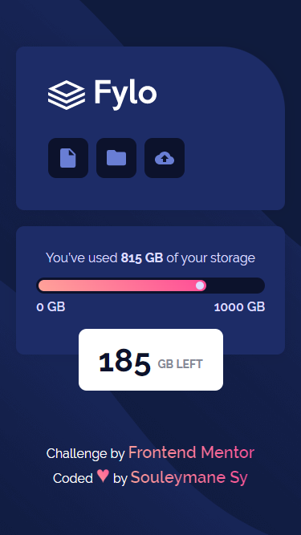
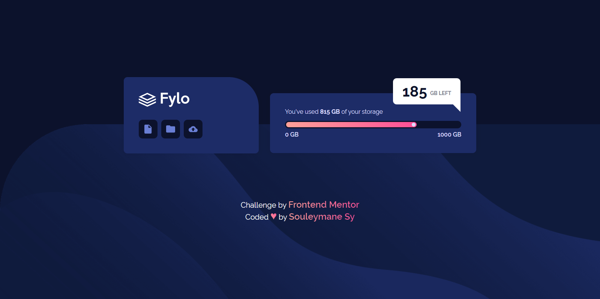

# Frontend Mentor - Fylo data storage component

## Welcome! 👋

Thanks for checking out this front-end coding challenge.

[Frontend Mentor](https://www.frontendmentor.io) challenges help you improve your coding skills by building realistic projects.

## The challenge

The challenge is to build out this data storage component and get it looking as close to the design as possible.

Your users should be able to:

- View the optimal layout for the site depending on their device's screen size

### Screenshot

This is the Screenshot of the projects a made!

### Mobile Screenshot

### Desktops Screenshot

### Links

- Solution URL: [solution URL here](https://www.frontendmentor.io/solutions/fylo-data-storage-components-responsive-made-with-html-and-sass-rsGj_-npJJ)
- Live Site URL: [live site URL here](https://fem-fylo-data-strorage-component.vercel.app/)

## My process

Made this projects with HTML5 and SASS !!!

### Built with

- Semantic HTML5 markup
- SASS
- CSS custom properties
- Flexbox
- Mobile-first workflow
- npm

## Author

- GitHub - [Souleymane Sy](https://github.com/SouleymaneSy7)
- Frontend Mentor - [@SouleymaneSy7](https://www.frontendmentor.io/profile/SouleymaneSy7)
- Twitter - [@Souleymanesy43](https://twitter.com/Souleymanesy43)
